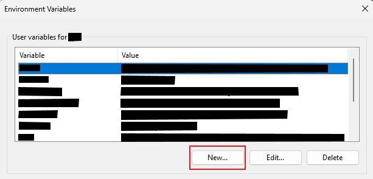
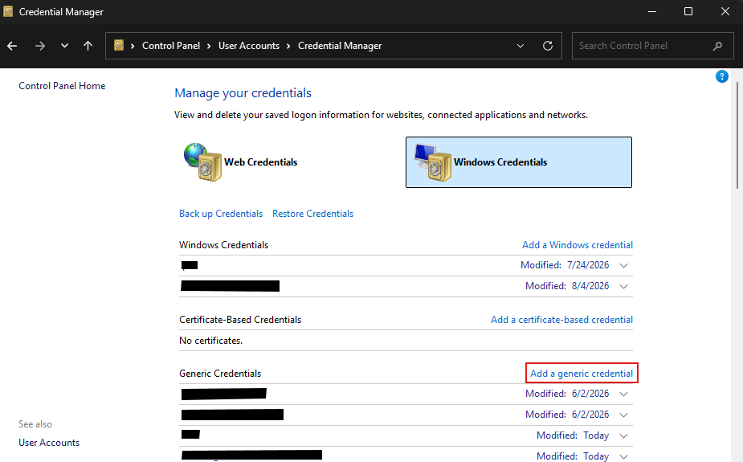
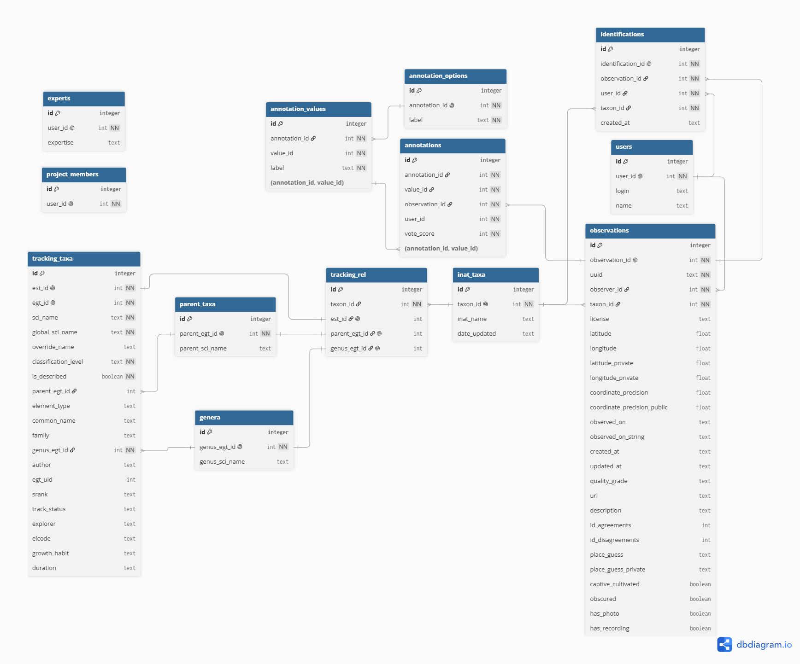

# iNaturalist Data Pipeline

A toolbox of data aquisition and transformation tools for importing iNaturalist data into Biotics.

The aim is to provide an easy automated way to ingest iNaturalist observations into the Biotics observations format. The toolbox creates mappings between tracking list taxon names and iNaturalist taxon names, downloads new observations, filters for records identified by experts, and exports reviewed observation data. It maintains a file-based GeoPackage (SQLite) database to integrate the iNaturalist data with information from a Biotics tracking list, allowing for name overrides, and cross-referencing identifications with a list of experts.

This repository contains the data pipeline package (```inatdatapipeline```), the ArcGIS Python Toolbox, and a directory structure for running the tool. Instructions are provided for the Windows operating system.

The code was adapted from the [iNatScraper repository](https://github.com/clark-hollenberg/iNatScraper) by Clark Hollenberg at CNHP and Kyle Kaskie at MTNHP.


## Setup
1. **Register for an iNaturalist app**. This is probably the most involved step, but it only needs to be done once, whereas the other steps may need to be repeated to get set up on different computers. Find out about becoming an app owner at this link: [iNaturalist Applications](https://www.inaturalist.org/oauth/applications). The callback URL is not important for this tool, so you can set it to https://localhost:8080 or some other arbitrary URL. Once you have your app ID and app secret, continue to the next step.

2. **Set environment variables**. Add your app ID and app secret as environment variables using the system control panel.
   * In the Start menu, search "edit the environment variables for your account" and select the result.
   * Create two new user environment variables. To create a variable, click the "New" button located under the list of user variables.

      
      
      Name the first variable ```INAT_APP_ID``` and set its value to your iNaturalist app ID. Name the second variable ```INAT_APP_SECRET``` and set its value to your iNaturalist app secret.

2. **Download or clone this repository**. Either clone the repository to your local machine using the command ```git clone https://github.com/spencer1202/iNaturalistDataPipelineORBIC.git```, or download the entire repository as a ZIP file and extract it onto your computer.

3. **Register iNaturalist account in credential manager**. In order to download the unobscured locations for observations that trust your account, the tool needs access to your iNaturalist credentials. For security purposes, those credentials must be stored in the Windows Credential Manager. Follow these instructions:
   * In the Start menu, search for “credential manager” and open it.
   * Select Windows Credentials. 
   * Scroll down to Generic credentials and click Add a generic credential.

      

   * Enter ```[your iNaturalist username]@/inaturalist``` as the internet network address, then enter your iNaturalist username and password and click ok.

4. **Set up Python environment**. The Python scripts depend on several underlying libraries that need to be set up. All of the environment specifications are provided in [environment.yml](environment.yml). Follow these steps to create a new conda environment in Command Prompt using the environment.yml configuration file. 
   * Open Windows Command Prompt, then activate conda with the following command (including the quotation marks):
   ```"C:\Program Files\ArcGIS\Pro\bin\Python\Scripts\proenv.bat"```
   * Enter this command (all on one line), where [Path To Toolbox Directory] is the top-level file path of the toolbox directory (e.g. "I:\Henwood\iNatArcProToolbox"), and [Your Username] is your Windows username:
   ```conda env create -f "[Path To Toolbox Directory]\environment.yml" -p "C:\Users\[Your Username]\AppData\Local\ESRI\conda\envs\inat-pipeline-py3"```
   For example, my command looks like this:
   ```conda env create -f "C:\Users\Henwood\Documents\iNatDataPipeline\environment.yml" -p "C:\Users\Henwood\AppData\Local\ESRI\conda\envs\inat-pipeline-py3"```

   Now open ArcGIS Pro and activate the environment. Open an ArcGIS Pro project, and navigate to the package manager (Project > Package Manager). Under the "Active Environment" dropdown at the top right, select the environment you just created. Then restart ArcGIS Pro.


## Usage
***Important Note**: The iNaturalist API limits the number of requests that can come from one iNaturalist client (that's this toolbox!) to 10,000 per day. To avoid getting your app disabled, avoid running any of the tools too many times. All of the tools report how many requests have been made so far, but as of now this number is a slight undercount, so avoid going above 9,000 requests.*

This pipeline is designed to be interacted with through an ArcGIS Pro Python Toolbox. It contains three tools which should be run roughly in sequence: Build Taxon Mapping, Download iNat Observations, and Perform Review of Observations. When run in order, these tools create a GeoPackage database containing all tracking list and iNaturalist observation data, then output a CSV file with a list of reviewed observations. More details on what these tables look like can be found in the [Methodology](#methodology) section.

It's recommended that after you run the taxon mapping tool, you should go through and manually verify the mappings before running the download tool. A good starting point is to filter for mappings where the Biotics name is different from the iNaturalist name. If any of the mappings are incorrect, you can go into the tracking_rel table in ArcGIS Pro and delete the corresponding row. The database will automatically clean up any orphaned iNaturalist taxon rows. Just be aware that if you run the mapping tool again, that incorrect mapping will be reinserted.

The tool will output run information in the Messages tab. For more detailed logs and debug information, check for a log file in the [logs](/logs) folder.

**The three tools have these parameters in common:**
* **Geopackage database file**. A GeoPackage (.gpkg) database file. This can be an existing file selected through the file browser, or you can manually edit the file path to create a new file. 
* **iNaturalist username**. This tells the tool what credentials to request from the system credential manager.


### Build Taxon Mapping

**Additional parameters:**
* **Tracking list file**: The file path of the tracking list exported from Biotics.
* **Name overrides file**: The file path of the name overrides file.

This tool inserts the Biotics tracking list into the GeoPackage database, then searches for matching taxa in iNaturalist and stores the resulting mappings. You'll need to create the tracking list and name overrides files if they don't already exist.

**Create the tracking list file** 
The query provided in [docs/biotics_query.sql](docs/biotics_query.sql), when pasted into the Biotics Query Builder, will generate a CSV in the required format. Tracking list files for ORBIC are provided in [data/taxonomy](data/taxonomy).

*Note: Running the taxa command takes a long time if you've got a long tracking list (about 1 second per taxon). I'd suggest breaking the tracking list file into several smaller files and running the taxa command on them one at a time.*

**Create the name overrides file**
A name override is a name to search for instead of the one in the Biotics tracking list (e.g. a known synonym or alternative spelling). Create the name overrides file to override any of the Biotics taxon names or their corresponding taxon IDs.

The name overrides file should be a CSV with at least these columns:
| Column    | Data type | Description |
|-----------|-----------|-------------|
| est_id    | integer   | Element subnational tracking ID |
| inat_name | string    | Scientific name to use instead of the Biotics one |
| taxon_id  | integer   | The taxon's iNaturalist ID |

Each row must include either ```inat_name``` or ```taxon_id```. If both are present, the inat name will be ignored. The name overrides file for ORBIC is provided in [data/taxonomy](data/taxonomy).


### Download iNat Observations
**Additional parameters:**
* **Place ID**. This is a unique location identifier that iNaturalist uses. Observations will be filtered for just those that occurred within the specified area. Replace this with the place ID of your state (Oregon = 10). If you're not sure what it is, go to the [Identify](https://www.inaturalist.org/observations/identify) tab in iNaturalist and enter the location in the *Place* search bar. Then check the URL for the place ID.
* **Quality grade**: Filters for observations with certain iNaturalist quality grades.
* **Update after days**: The tool keeps track of when observations were last pulled for each taxon and only searches for new observations made on or after that date. To speed things up, the tool will only include a taxon in the search if it was last updated more than a certain number of days ago, defined by this parameter. Set this to reset the last updated dates and search for all observations, regardless of date.
* **iNaturalist project ID**: Filter for observations that are included in the project with this ID.
* **Maximum observations to download**: The tool will stop requesting observations once it downloads this number of observations. This limit allows downloads to be performed in batches so one run of the tool doesn't take unreasonably long.

This tool fetches observations from iNaturalist and inserts them into the GeoPackage database. 

When running for the first time, there will likely be a very large quantity of observations to download. Avoid setting the maximum observations too high, or the run will take a very long time and any interruptions risk losing a lot of data. You'll likely have to run the tool several times until all observations are downloaded. Check the output messages to determine whether the tool finished downloading observations during a given run, and keep an eye on the number of requests made today.


### Perform Review of Observations
**Additional parameters:**
* **Update project members and annotations from iNaturalist?**: Whether or not the tool should fetch the list of project members and the possible iNaturalist annotation values from the iNaturalist API. If checked, both the iNaturalist project ID and an iNaturalist username are required. If left unchecked, those two parameters are not provided.
* **iNaturalist project ID** *(Optional)*: Project members have agreed to provide a license to use their observations with attribution, so the review requires a list of project members. This parameter specifies which project to download members from.
* **Experts file**: A list of trusted experts with their iNaturalist user IDs and their taxonomic expertise.
* **Experts file iNaturalist ID field**: The field from the experts file that contains iNaturalist user IDs.
* **Experts file expertise field**: The field from the experts file that contains the taxonomic expertise pattern.
* **Output format**: Whether the reviewed observations should be exported as a CSV or a GeoDatabase Feature Class.
* **Export CSV** *(Optional)*: A filepath for the reviewed output CSV.
* **Export feature class** *(Optional)*: The name of the output feature class to be created.

This tool reviews the downloaded observations for expert agreement, evaluates licenses, reformats fields effected by geoprivacy settings, and exports the resulting table as a CSV or a feature class. 

**Notes on conversion to GDB**
The iNaturalist API uses the GeoJSON standard to encode coordinate information, which specifies WGS84 as the coordinate system ([Wikipedia](https://en.wikipedia.org/wiki/GeoJSON#Geometries)).


## Methodology
This section provides more detailed information on the steps each tool performs.
### Building the taxon mapping
The tool builds the taxon mapping following these steps:
1. Load any existing mappings from the database.
2. Load and validate the tracking list and name overrides files. Both files must follow the format specified in the [Usage](#build-taxon-mapping) section or this step will fail.
3. Prepare the tracking list by mapping name overrides, preprocessing scientific names, marking undescribed taxa, and filling in missing parent taxon IDs. More information on these steps is provided below.
4. Filter out taxa that have already been mapped.
5. Walk through each taxon in the tracking list and search the iNaturalist taxa API using the preprocessed scientific name, or the override name when present, or bypassing the name entirely to search by taxon ID when one is provided in the overrides list. Start the search at the taxon's own taxonomic classification level, then search the taxon's higher levels until either a result is found, or the search at the genus level returns no results. If the API returns any results, select a match only if its name or one of its synonyms exactly matches the search term.
6. Validate that the resulting mappings are in the expected format.
7. Insert the cleaned tracking list and the new mappings into the GeoPackage database. 

**Name overrides**
Most of the time you'll only have the override names, in which case the taxon_id column may be all blank. But if iNaturalist's search function is being particularly stubborn, you can include the exact ID of the iNaturalist taxon that matches the Biotics one. The tool will ignore the scientific names entirely and search directly by taxon ID. It still searches for these taxa to verify that the IDs actually exists.

**Preprocessing scientific names**
When searching iNaturalist to build the mapping between Biotics and iNaturalist taxa, scientific names from Biotics need to be converted into the trinomial format that iNaturalist prefers. This means removing the abbreviations var., pop., and ssp.

**Undescribed taxa**
Undescribed species, subspecies, and populations all have a number in their scientific name in Biotics. Since these undescribed taxa are what's actually being tracked and not their broader taxonomic group, these taxa are marked in the database as undescribed and their parent taxon is used for mapping.

Currently, there are still rare cases where iNaturalist's taxon search is way off base. There are also synonyms to worry about that iNaturalist might not catch. Name and taxon ID overrides are the workaround.

### Downloading observations
The tool downloads observations following these steps:
1. Retrieve taxon mappings from the database.
2. Filter out taxa with parent/genus based mappings and taxa that have been updated less than the specified number of days ago.
3. Download observations using the filters given by the parameters. Taxa are searched for in batches.
4. Structure the API responses. Observations are returned as JSON-encoded records that need to be unpacked and structured into their component observation, identifications, users, and annotations.
5. Validates the results and inserts them into the observations, identifications, users, and annotations tables.

### Running the review
The tool runs a review by following these steps:
1. Download the list of project members and insert it into the database.
2. Download the selection of annotation options and annotation values from iNaturalist and insert it into the database.
3. Load and validate the experts list.
4. Load observation data from the database. Identifications are queried using a function that selects only identifications made by users listed as experts, whose expertise matches the taxon they are suggesting.
5. Where an expert user does not have a name on their profile, fill it in with their username.
6. Mark observations that have at least one expert identification and where all expert identifications agree with the community taxon.
7. Add a column that lists the name of the expert (if any) who most recently identified each observation, and a column listing the date of this identification.
8. Create a column that lists all of the experts (if any) who identified an observation from newest to oldest.
9. Create a column that compiles all of the annotations left on an observation.
10. Mark observations made by project members as granting a CC-BY license, then evaluate whether each observation has granted a sufficient license for reuse. 
11. Merge the public/private location fields (latitude/longiture, precision, place guess) where obscured coordinates have been revealed to the authenticated account used to run the Download iNat Observations tool. Location fields are replaced where their private counterparts are populated. Rows are recategorized as obscured if they were previously marked as obscured AND the private coordinates are not populated.
12. Format the observation data for export. Currently this includes creating a "visited by" column, adding several static fields that are the same for every row, adding a column that reports whether an observation has a photo, recording, or both, and renames and reorders columns. 

The current export format uses column names chosen to match with a previously created observations dataset which does not use a consistent naming scheme. At some point in the future I may clean up the format to be clearer and more generalizable.


### Database Schema
This program uses SQLite - a local file-based database system - to store, update, and manipulate taxon and observation data. This model accurately represents the data and its relationships, while allowing for complex customizable queries. 



Some of the database tables are further elaborated on below. This is not how they will appear in the output, but how they're stored in the database.

**Tracking List (```tracking_taxa```)**
This table represents the Biotics tracking list. Most of the fields are directly from Biotics, with the exception of ```search_name``` and ```is_described```.
| Field | Data Type | Description |
|-------|-----------|-------------|
| est_id | integer | Element subnational ID from Biotics. |
| egt_id | integer | Element global tracking ID from Biotics. Used to fill in missing parent global tracking IDs |
| sci_name | string | Taxon's scientific name, verbatim from the Biotics tracking list. |
| global_sci_name | string | Taxon's Biotics global tracking element name. Used to fill in missing parent scientific names. |
| override_name | string | Taxon's manually mapped iNaturalist name. |
| classification_level | string | Taxon's taxonomic level (i.e. species, subspecies, variety, population). |
| is_described | boolean | Whether the taxon is described. This is false for taxa that have a number in their scientific name (see [Undescribed taxa](#undescribed-taxa)). |
| parent_egt_id | integer | The element global tracking ID of this taxon's parent species. Only populated for taxa that have a parent species (subspecies, varieties, and populations). |
| element_type | string | A Biotics categorization that places taxa into either "Plant" (which includes fungi) or "Animal". Field is empty for chromists. |
| common_name | string | Taxon's common name from Biotics. |
| family | string | Taxon's family name. |
| genus_egt_id | integer | The element global tracking ID of this taxon's genus. |
| author | string | Taxon's author citation. |
| egt_uid | string | Another ID used by Biotics. |
| srank | string | Taxon's subnational rank. |
| track_status | string | Taxon's tracking status in Biotics, e.g. "Track all extant and selected historical EOs". |
| explorer | string | Link to the taxon's NatureServe explorer page. |
| elcode | string | Taxon's Biotics ELCODE. |
| growth_habit | string | The growth habit for plants and fungi. Field may be empty. |
| duration | string | The life history strategy of plants (e.g. annual vs. perennial) and fungi. Field may be empty. |

**iNaturalist Taxa (```inat_taxa```)**
This table represents taxa found in iNaturalist. It also keeps track of the date that observations were last updated for each taxon.
| Field | Data Type | Description |
|-------|-----------|-------------|
| taxon_id | integer | Taxon's iNaturalist ID. |
| est_id | integer | Taxon's element subnational ID. There may be multiple entries for one ```est_id```, like if there are multiple undescribed taxa in the same broader taxonomic group. |
| name | string | Taxon's scientific name in iNaturalist. |
| date_updated | date | The most recent date that observations were queried for this taxon. This is used to narrow future queries to just observations made after this date. |

**Experts (```experts```)**
This table represents the experts list. Expert user IDs are loaded from the experts CSV file, but names and usernames are fetched directly from iNaturalist in case anything has changed since the experts CSV file was created.
| Field | Data Type | Description |
|-------|-----------|-------------|
| user_id | integer | The expert's user ID. |
| expertise | string | A pattern string that matches the ELCODEs of the taxa the expert is qualified to identify. |

**Observations (```observations```)**
This table represents each individual observation. The data stored here has not been reviewed for expert agreement or permissions, and the public/private location fields are separate. See [this help page](https://help.inaturalist.org/en/support/solutions/articles/151000169938-what-is-geoprivacy-what-does-it-mean-for-an-observation-to-be-obscured-) for more information on geoprivacy and obscured observations.
| Field | Data Type | Description |
|-------|-----------|-------------|
| observation_id | integer | This observation's iNaturalist ID number. |
| uuid | string | The universally unique identifier string for this observation. |
| observer_id | integer | The user ID of the user who created this observation. |
| taxon_id | integer | The Observation Taxon assigned by iNaturalist ([see here for more info on what this means](https://help.inaturalist.org/en/support/solutions/articles/151000173076-what-are-the-community-taxon-and-the-observation-taxon-)). |
| license | string | This observation's content license. |
| longitude | float | The publicly viewable longitude of this observation. If the value of the obscured field is true, this value is the obscured longitude. |
| latitude | float | The publicly viewable latitude of this observation. If the value of the obscured field is true, this value is the obscured latitude. |
| longitude_private | float | The true longitude if this observation is obscured. This is null for unobscured observations and obscured observations the user does not have permission to access the true location of. |
| latitude_private | float | The true latitude if this observation is obscured. This is null for unobscured observations and obscured observations the user does not have permission to access the true location of. |
| coordinate_precision | float | The positional uncertainty of the observation's location. |
| coordinate_precision_public | float | The observation's publicly visible positional uncertainty. If an observation is obscured, this is expanded to the size of the obscuration rectangle. |
| observed_on | date | The date the observation was made, in the format YYYY-MM-DD. |
| observed_on_string | string | The date the observation was made as an unformatted string. |
| created_at | date | The date this observation was posted to iNaturalist. |
| updated_at | date | The date that this observation was last updated. |
| quality_grade | string | The [iNaturalist quality grade](https://help.inaturalist.org/en/support/solutions/articles/151000169936-what-is-the-data-quality-assessment-dqa-and-how-do-observations-qualify-to-become-research-grade-) of this observation. |
| url | string | The observation's URL. |
| description | string | A user-provided description of this observation. |
| id_agreements | integer | The number of identifications with taxa that are or are contained by the [Community Taxon](https://help.inaturalist.org/en/support/solutions/articles/151000173076-what-are-the-community-taxon-and-the-observation-taxon-). |
| id_disagreements | integer | The number of identifications that are not contained by the Community Taxon. |
| place_guess | string | A user-provided description of where the observation was made. |
| place_guess_private | string | The true, unobscured description of where the observation was made. |
| captive_cultivated | boolean | Whether the organism is present in its location because of direct human placement or management. |
| obscured | boolean | Whether the observation's location has been obscured due to the observation's geoprivacy or taxon geoprivacy settings. |
| has_photo | boolean | Whether the observation has at least one photo. |
| has_recording | boolean | Whether the observation has at least one audio recording. |

**Annotations (```annotations```)**

This table is a result of the strange way iNaturalist stores annotations and their possible values. The tables ```annotation_options``` and ```annotation_values``` are populated with the options iNaturalist provides for annotating observations. The ```annotations``` table stores actual annotations by referencing these tables. The view ```annotations_with_labels``` provides a more cohesive representation of annotations.